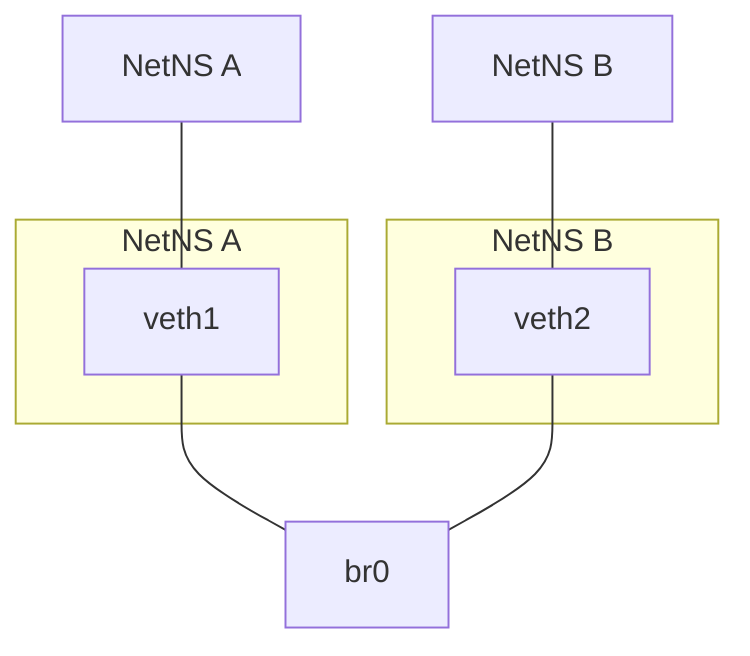

### Network Namespace Bridge

We create two isolated network namespaces, `A` and `B`, and connect them via a bridge interface `br0`. Each namespace is assigned a virtual Ethernet (veth) interface, which is then connected to the bridge.



```sh
# Create namespaces and bridge
ip netns add A; ip netns add B; ip link add br0 type bridge; ip link set br0 up
# ip netns ls: A B
# ip link show br0: br0: <BROADCAST,MULTICAST,UP,LOWER_UP> ...

# Create veth pairs and move to namespaces
ip link add veth1 type veth peer name veth1-br; ip link add veth2 type veth peer name veth2-br
ip link set veth1 netns A; ip link set veth2 netns B
# ip netns exec A ip link: lo, veth1
# ip netns exec B ip link: lo, veth2

# Attach veth-br to bridge and bring interfaces up
ip link set veth1-br master br0; ip link set veth2-br master br0; ip link set veth1-br up; ip link set veth2-br up
ip netns exec A ip link set veth1 up; ip netns exec B ip link set veth2 up
# ip link show br0: br0: <BROADCAST,MULTICAST,UP,LOWER_UP> ... veth1-br, veth2-br

# Assign IP addresses and test connectivity
ip netns exec A ip addr add 10.0.0.1/24 dev veth1; ip netns exec B ip addr add 10.0.0.2/24 dev veth2
# ip netns exec A ip addr show veth1: 10.0.0.1/24
# ip netns exec B ip addr show veth2: 10.0.0.2/24
ip netns exec A ping 10.0.0.2 -c 3;
# output:
# PING 10.0.0.2 (10.0.0.2) 56(84) bytes of data.
# 64 bytes from 10.0.0.2: icmp_seq=1 ttl=64 time=0.075 ms
# 64 bytes from 10.0.0.2: icmp_seq=2 ttl=64 time=0.046 ms
# 64 bytes from 10.0.0.2: icmp_seq=3 ttl=64 time=0.046 ms
# --- 10.0.0.2 ping statistics ---
# 3 packets transmitted, 3 received, 0% packet loss, time 2038ms
# rtt min/avg/max/mdev = 0.046/0.055/0.075/0.014 ms
ip netns exec B ping 10.0.0.1 -c 3
# output:
# PING 10.0.0.1 (10.0.0.1) 56(84) bytes of data.
# 64 bytes from 10.0.0.1: icmp_seq=1 ttl=64 time=0.075 ms
# 64 bytes from 10.0.0.1: icmp_seq=2 ttl=64 time=0.046 ms
# 64 bytes from 10.0.0.1: icmp_seq=3 ttl=64 time=0.046 ms
# --- 10.0.0.1 ping statistics ---
# 3 packets transmitted, 3 received, 0% packet loss, time 2038ms
# rtt min/avg/max/mdev = 0.046/0.055/0.075/0.014 ms

# Bring up loopback and test local ping
ip netns exec A ip link set lo up; ip netns exec A ping 10.0.0.1 -c 3
# output:
# PING 10.0.0.1 (10.0.0.1) 56(84) bytes of data.
# 64 bytes from 10.0.0.1: icmp_seq=1 ttl=64 time=0.075 ms
# 64 bytes from 10.0.0.1: icmp_seq=2 ttl=64 time=0.046 ms
# 64 bytes from 10.0.0.1: icmp_seq=3 ttl=64 time=0.046 ms
# --- 10.0.0.1 ping statistics ---
# 3 packets transmitted, 3 received, 0% packet loss, time 2038ms
# rtt min/avg/max/mdev = 0.046/0.055/0.075/0.014 ms
```
