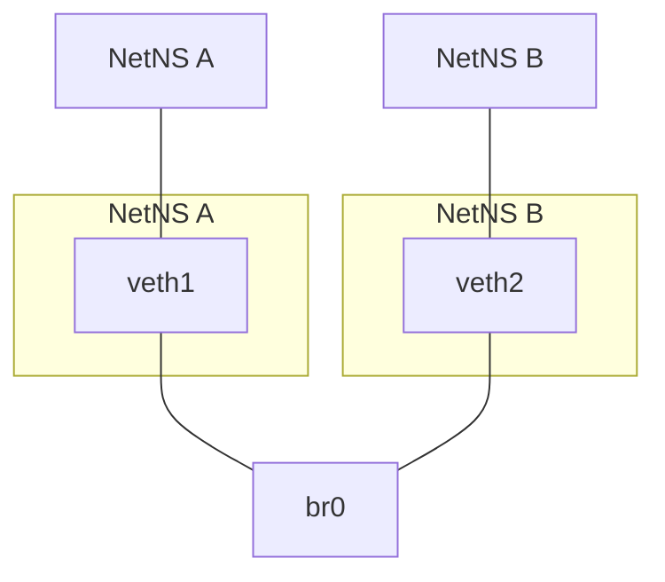

### Network Namespace Bridge

We create two isolated network namespaces, `A` and `B`, and connect them via a bridge interface `br0`. Each namespace is assigned a virtual Ethernet (veth) interface, which is then connected to the bridge.



```sh
# Create namespaces and bridge
ip netns add A; ip netns add B; ip link add br0 type bridge; ip link set br0 up
# ip netns ls: A B
# ip link show br0: br0: <BROADCAST,MULTICAST,UP,LOWER_UP> ...

# Create veth pairs and move to namespaces
ip link add veth1 type veth peer name veth1-br; ip link add veth2 type veth peer name veth2-br
ip link set veth1 netns A; ip link set veth2 netns B
# ip netns exec A ip link: lo, veth1
# ip netns exec B ip link: lo, veth2

# Attach veth-br to bridge and bring interfaces up
ip link set veth1-br master br0; ip link set veth2-br master br0; ip link set veth1-br up; ip link set veth2-br up
ip netns exec A ip link set veth1 up; ip netns exec B ip link set veth2 up
# ip link show br0: br0: <BROADCAST,MULTICAST,UP,LOWER_UP> ... veth1-br, veth2-br

# Assign IP addresses and test connectivity
ip netns exec A ip addr add 10.0.0.1/24 dev veth1; ip netns exec B ip addr add 10.0.0.2/24 dev veth2
# ip netns exec A ip addr show veth1: 10.0.0.1/24
# ip netns exec B ip addr show veth2: 10.0.0.2/24
ip netns exec A ping 10.0.0.2 -c 3;
# output:
# PING 10.0.0.2 (10.0.0.2) 56(84) bytes of data.
# 64 bytes from 10.0.0.2: icmp_seq=1 ttl=64 time=0.075 ms
# 64 bytes from 10.0.0.2: icmp_seq=2 ttl=64 time=0.046 ms
# 64 bytes from 10.0.0.2: icmp_seq=3 ttl=64 time=0.046 ms
# --- 10.0.0.2 ping statistics ---
# 3 packets transmitted, 3 received, 0% packet loss, time 2038ms
# rtt min/avg/max/mdev = 0.046/0.055/0.075/0.014 ms
ip netns exec B ping 10.0.0.1 -c 3
# output:
# PING 10.0.0.1 (10.0.0.1) 56(84) bytes of data.
# 64 bytes from 10.0.0.1: icmp_seq=1 ttl=64 time=0.075 ms
# 64 bytes from 10.0.0.1: icmp_seq=2 ttl=64 time=0.046 ms
# 64 bytes from 10.0.0.1: icmp_seq=3 ttl=64 time=0.046 ms
# --- 10.0.0.1 ping statistics ---
# 3 packets transmitted, 3 received, 0% packet loss, time 2038ms
# rtt min/avg/max/mdev = 0.046/0.055/0.075/0.014 ms

# Bring up loopback and test local ping
ip netns exec A ip link set lo up; ip netns exec A ping 10.0.0.1 -c 3
# output:
# PING 10.0.0.1 (10.0.0.1) 56(84) bytes of data.
# 64 bytes from 10.0.0.1: icmp_seq=1 ttl=64 time=0.075 ms
# 64 bytes from 10.0.0.1: icmp_seq=2 ttl=64 time=0.046 ms
# 64 bytes from 10.0.0.1: icmp_seq=3 ttl=64 time=0.046 ms
# --- 10.0.0.1 ping statistics ---
# 3 packets transmitted, 3 received, 0% packet loss, time 2038ms
# rtt min/avg/max/mdev = 0.046/0.055/0.075/0.014 ms
```

### Isolated Networks with Router

We make separate networks (A, B, C, D) and connect them with a router (R). This lets the networks talk to each other and to a host computer.

```mermaid
graph LR
    A(A: 10.0.1.1/24) -- veth-A --> br0(br0);
    B(B: 10.0.1.2/24) -- veth-B --> br0;
    C(C: 10.0.2.1/24) -- veth-C --> br1(br1);
    D(D: 10.0.2.2/24) -- veth-D --> br1;
    br0 -- veth-br0-r --> R(R: Router);
    br1 -- veth-br1-r --> R;
    R -- veth-r-host --> Host[Host: 192.168.1.1/24];

    style A fill:#4a148c,stroke:#9575cd,stroke-width:2px;
    style B fill:#4a148c,stroke:#9575cd,stroke-width:2px;
    style C fill:#4a148c,stroke:#9575cd,stroke-width:2px;
    style D fill:#4a148c,stroke:#9575cd,stroke-width:2px;
    style R fill:#1a237e,stroke:#7986cb,stroke-width:2px;
    style br0 fill:#004d40,stroke:#4db6ac,stroke-width:2px;
    style br1 fill:#004d40,stroke:#4db6ac,stroke-width:2px;
    style Host fill:#263238,stroke:#607d8b,stroke-width:2px;

    direction LR;
```



```sh
# Create network namespaces and verify
ip netns add A; ip netns add B; ip netns add C; ip netns add D; ip netns add R;
ip netns list
# R (id: X)
# D (id: X)
# C (id: X)
# B (id: X)
# A (id: X)

# Create bridges and verify
ip link add br0 type bridge; ip link add br1 type bridge;
ip link show type bridge
# X: br1: <BROADCAST,MULTICAST> mtu 1500 qdisc noop state DOWN mode DEFAULT group default qlen 1000
# X: br0: <BROADCAST,MULTICAST> mtu 1500 qdisc noop state DOWN mode DEFAULT group default qlen 1000

# Create veth pairs for each namespace
ip link add veth-A type veth peer name veth-A-br;
ip link add veth-B type veth peer name veth-B-br;
ip link add veth-C type veth peer name veth-C-br;
ip link add veth-D type veth peer name veth-D-br;

# Create veth pairs for bridges to router and host
ip link add veth-br0-r type veth peer name veth-r-br0;
ip link add veth-br1-r type veth peer name veth-r-br1;
ip link add veth-r-host type veth peer name veth-host-r;
ip link show type veth
# Multiple veth pairs showing with their respective names and all in DOWN state
# Each pair will be linked (showing the peer interface index)

# Connect namespaces to bridges and verify
ip link set veth-A-br master br0; ip link set veth-B-br master br0;
ip link set veth-C-br master br1; ip link set veth-D-br master br1;
bridge link show
# X: veth-A-br: <BROADCAST,MULTICAST> mtu 1500 master br0 state disabled priority 32 cost 100
# X: veth-B-br: <BROADCAST,MULTICAST> mtu 1500 master br0 state disabled priority 32 cost 100
# X: veth-C-br: <BROADCAST,MULTICAST> mtu 1500 master br1 state disabled priority 32 cost 100
# X: veth-D-br: <BROADCAST,MULTICAST> mtu 1500 master br1 state disabled priority 32 cost 100

# Move veth pairs to namespaces
ip link set veth-A netns A; ip link set veth-B netns B;
ip link set veth-C netns C; ip link set veth-D netns D;
ip link set veth-r-br0 netns R; ip link set veth-r-br1 netns R;
ip link set veth-r-host netns R;
for NS in A B C D R; do ip netns exec $NS ip link show; done
# For each namespace (A, B, C, D):
#   1: lo: <LOOPBACK> mtu 65536 qdisc noop state DOWN mode DEFAULT group default qlen 1000
#   X: veth-X: <BROADCAST,MULTICAST> mtu 1500 qdisc noop state DOWN mode DEFAULT group default qlen 1000
# For namespace R:
#   1: lo: <LOOPBACK> mtu 65536 qdisc noop state DOWN mode DEFAULT group default qlen 1000
#   X: veth-r-br0: <BROADCAST,MULTICAST> mtu 1500 qdisc noop state DOWN mode DEFAULT group default qlen 1000
#   X: veth-r-br1: <BROADCAST,MULTICAST> mtu 1500 qdisc noop state DOWN mode DEFAULT group default qlen 1000
#   X: veth-r-host: <BROADCAST,MULTICAST> mtu 1500 qdisc noop state DOWN mode DEFAULT group default qlen 1000

# Configure namespace A and verify
ip netns exec A ip addr add 10.0.1.1/24 dev veth-A;
ip netns exec A ip link set veth-A up;
ip netns exec A ip link set lo up;
ip netns exec A ip route add default via 10.0.1.254;
ip netns exec A ip addr show; ip netns exec A ip route show
# 1: lo: <LOOPBACK,UP,LOWER_UP> mtu 65536 qdisc noqueue state UNKNOWN group default qlen 1000
#    inet 127.0.0.1/8 scope host lo
#       valid_lft forever preferred_lft forever
# X: veth-A: <BROADCAST,MULTICAST,UP,LOWER_UP> mtu 1500 qdisc noqueue state UP group default qlen 1000
#    inet 10.0.1.1/24 scope global veth-A
#       valid_lft forever preferred_lft forever
# 
# default via 10.0.1.254 dev veth-A 
# 10.0.1.0/24 dev veth-A proto kernel scope link src 10.0.1.1

# Configure namespace B and verify
ip netns exec B ip addr add 10.0.1.2/24 dev veth-B;
ip netns exec B ip link set veth-B up;
ip netns exec B ip link set lo up;
ip netns exec B ip route add default via 10.0.1.254;
ip netns exec B ip addr show; ip netns exec B ip route show
# 1: lo: <LOOPBACK,UP,LOWER_UP> mtu 65536 qdisc noqueue state UNKNOWN group default qlen 1000
#    inet 127.0.0.1/8 scope host lo
#       valid_lft forever preferred_lft forever
# X: veth-B: <BROADCAST,MULTICAST,UP,LOWER_UP> mtu 1500 qdisc noqueue state UP group default qlen 1000
#    inet 10.0.1.2/24 scope global veth-B
#       valid_lft forever preferred_lft forever
#
# default via 10.0.1.254 dev veth-B 
# 10.0.1.0/24 dev veth-B proto kernel scope link src 10.0.1.2 

# Configure namespace C and verify
ip netns exec C ip addr add 10.0.2.1/24 dev veth-C;
ip netns exec C ip link set veth-C up;
ip netns exec C ip link set lo up;
ip netns exec C ip route add default via 10.0.2.254;
ip netns exec C ip addr show; ip netns exec C ip route show
# 1: lo: <LOOPBACK,UP,LOWER_UP> mtu 65536 qdisc noqueue state UNKNOWN group default qlen 1000
#    inet 127.0.0.1/8 scope host lo
#       valid_lft forever preferred_lft forever
# X: veth-C: <BROADCAST,MULTICAST,UP,LOWER_UP> mtu 1500 qdisc noqueue state UP group default qlen 1000
#    inet 10.0.2.1/24 scope global veth-C
#       valid_lft forever preferred_lft forever
#
# default via 10.0.2.254 dev veth-C 
# 10.0.2.0/24 dev veth-C proto kernel scope link src 10.0.2.1

# Configure namespace D and verify
ip netns exec D ip addr add 10.0.2.2/24 dev veth-D;
ip netns exec D ip link set veth-D up;
ip netns exec D ip link set lo up;
ip netns exec D ip route add default via 10.0.2.254;
ip netns exec D ip addr show; ip netns exec D ip route show
# 1: lo: <LOOPBACK,UP,LOWER_UP> mtu 65536 qdisc noqueue state UNKNOWN group default qlen 1000
#    inet 127.0.0.1/8 scope host lo
#       valid_lft forever preferred_lft forever
# X: veth-D: <BROADCAST,MULTICAST,UP,LOWER_UP> mtu 1500 qdisc noqueue state UP group default qlen 1000
#    inet 10.0.2.2/24 scope global veth-D
#       valid_lft forever preferred_lft forever
#
# default via 10.0.2.254 dev veth-D 
# 10.0.2.0/24 dev veth-D proto kernel scope link src 10.0.2.2

# Configure Router namespace and verify
ip netns exec R ip link set lo up;
ip netns exec R ip addr add 10.0.1.254/24 dev veth-r-br0;
ip netns exec R ip addr add 10.0.2.254/24 dev veth-r-br1;
ip netns exec R ip addr add 192.168.1.100/24 dev veth-r-host;
ip netns exec R ip link set veth-r-br0 up;
ip netns exec R ip link set veth-r-br1 up;
ip netns exec R ip link set veth-r-host up;
ip netns exec R ip addr show; ip netns exec R ip route show
# 1: lo: <LOOPBACK,UP,LOWER_UP> mtu 65536 qdisc noqueue state UNKNOWN group default qlen 1000
#    inet 127.0.0.1/8 scope host lo
#       valid_lft forever preferred_lft forever
# X: veth-r-br0: <BROADCAST,MULTICAST,UP,LOWER_UP> mtu 1500 qdisc noqueue state UP group default qlen 1000
#    inet 10.0.1.254/24 scope global veth-r-br0
#       valid_lft forever preferred_lft forever
# X: veth-r-br1: <BROADCAST,MULTICAST,UP,LOWER_UP> mtu 1500 qdisc noqueue state UP group default qlen 1000
#    inet 10.0.2.254/24 scope global veth-r-br1
#       valid_lft forever preferred_lft forever
# X: veth-r-host: <BROADCAST,MULTICAST,UP,LOWER_UP> mtu 1500 qdisc noqueue state UP group default qlen 1000
#    inet 192.168.1.100/24 scope global veth-r-host
#       valid_lft forever preferred_lft forever
#
# 10.0.1.0/24 dev veth-r-br0 proto kernel scope link src 10.0.1.254 
# 10.0.2.0/24 dev veth-r-br1 proto kernel scope link src 10.0.2.254
# 192.168.1.0/24 dev veth-r-host proto kernel scope link src 192.168.1.100

# Configure host side of the router connection and verify
ip addr add 192.168.1.1/24 dev veth-host-r;
ip link set veth-host-r up;
ip addr show dev veth-host-r
# X: veth-host-r: <BROADCAST,MULTICAST,UP,LOWER_UP> mtu 1500 qdisc noqueue state UP group default qlen 1000
#    inet 192.168.1.1/24 scope global veth-host-r
#       valid_lft forever preferred_lft forever

# Enable IP forwarding and verify
ip netns exec R sysctl -w net.ipv4.ip_forward=1;
ip netns exec R sysctl net.ipv4.ip_forward;
sysctl -w net.ipv4.ip_forward=1;
sysctl net.ipv4.ip_forward
# net.ipv4.ip_forward = 1
# net.ipv4.ip_forward = 1
# net.ipv4.ip_forward = 1
# net.ipv4.ip_forward = 1

# Add default route in router namespace and verify
ip netns exec R ip route add default via 192.168.1.1;
ip netns exec R ip route show
# default via 192.168.1.1 dev veth-r-host 
# 10.0.1.0/24 dev veth-r-br0 proto kernel scope link src 10.0.1.254 
# 10.0.2.0/24 dev veth-r-br1 proto kernel scope link src 10.0.2.254
# 192.168.1.0/24 dev veth-r-host proto kernel scope link src 192.168.1.100

# Bring up all interfaces and verify
ip link set veth-A-br up; ip link set veth-B-br up;
ip link set veth-C-br up; ip link set veth-D-br up;
ip link set br0 up; ip link set br1 up;
ip link show veth-A-br; ip link show veth-B-br;
ip link show veth-C-br; ip link show veth-D-br;
ip link show br0; ip link show br1
# X: veth-A-br: <BROADCAST,MULTICAST,UP,LOWER_UP> mtu 1500 qdisc noqueue master br0 state UP mode DEFAULT group default qlen 1000
# X: veth-B-br: <BROADCAST,MULTICAST,UP,LOWER_UP> mtu 1500 qdisc noqueue master br0 state UP mode DEFAULT group default qlen 1000
# X: veth-C-br: <BROADCAST,MULTICAST,UP,LOWER_UP> mtu 1500 qdisc noqueue master br1 state UP mode DEFAULT group default qlen 1000
# X: veth-D-br: <BROADCAST,MULTICAST,UP,LOWER_UP> mtu 1500 qdisc noqueue master br1 state UP mode DEFAULT group default qlen 1000
# X: br0: <BROADCAST,MULTICAST,UP,LOWER_UP> mtu 1500 qdisc noqueue state UP mode DEFAULT group default qlen 1000
# X: br1: <BROADCAST,MULTICAST,UP,LOWER_UP> mtu 1500 qdisc noqueue state UP mode DEFAULT group default qlen 1000

# Add router-bridge interfaces to bridges and verify
ip link set veth-br0-r master br0;
ip link set veth-br1-r master br1;
ip link set veth-br0-r up;
ip link set veth-br1-r up;
bridge link show
# X: veth-A-br: <BROADCAST,MULTICAST,UP,LOWER_UP> mtu 1500 master br0 state forwarding priority 32 cost 100
# X: veth-B-br: <BROADCAST,MULTICAST,UP,LOWER_UP> mtu 1500 master br0 state forwarding priority 32 cost 100
# X: veth-br0-r: <BROADCAST,MULTICAST,UP,LOWER_UP> mtu 1500 master br0 state forwarding priority 32 cost 100
# X: veth-C-br: <BROADCAST,MULTICAST,UP,LOWER_UP> mtu 1500 master br1 state forwarding priority 32 cost 100
# X: veth-D-br: <BROADCAST,MULTICAST,UP,LOWER_UP> mtu 1500 master br1 state forwarding priority 32 cost 100
# X: veth-br1-r: <BROADCAST,MULTICAST,UP,LOWER_UP> mtu 1500 master br1 state forwarding priority 32 cost 100

# Run connectivity tests
# Test br0 network
ip netns exec A ping -c 2 10.0.1.2;
ip netns exec B ping -c 2 10.0.1.1;
ip netns exec A ping -c 2 10.0.1.254;
ip netns exec B ping -c 2 10.0.1.254
# PING 10.0.1.2 (10.0.1.2) 56(84) bytes of data.
# 64 bytes from 10.0.1.2: icmp_seq=1 ttl=64 time=0.xxx ms
# 64 bytes from 10.0.1.2: icmp_seq=2 ttl=64 time=0.xxx ms
# (Similar successful ping results for other tests)

# Test br1 network
ip netns exec C ping -c 2 10.0.2.2;
ip netns exec D ping -c 2 10.0.2.1;
ip netns exec C ping -c 2 10.0.2.254;
ip netns exec D ping -c 2 10.0.2.254
# PING 10.0.2.2 (10.0.2.2) 56(84) bytes of data.
# 64 bytes from 10.0.2.2: icmp_seq=1 ttl=64 time=0.xxx ms
# 64 bytes from 10.0.2.2: icmp_seq=2 ttl=64 time=0.xxx ms
# (Similar successful ping results for other tests)

# Test cross-network connectivity
ip netns exec A ping -c 2 10.0.2.1;
ip netns exec A ping -c 2 10.0.2.2;
ip netns exec C ping -c 2 10.0.1.1;
ip netns exec C ping -c 2 10.0.1.2
# PING 10.0.2.1 (10.0.2.1) 56(84) bytes of data.
# 64 bytes from 10.0.2.1: icmp_seq=1 ttl=63 time=0.xxx ms
# 64 bytes from 10.0.2.1: icmp_seq=2 ttl=63 time=0.xxx ms
# (Similar successful ping results for other tests)

# Test internet connectivity
ip netns exec A ping -c 2 8.8.8.8;
ip netns exec B ping -c 2 8.8.8.8;
ip netns exec C ping -c 2 8.8.8.8;
ip netns exec D ping -c 2 8.8.8.8
# PING 8.8.8.8 (8.8.8.8) 56(84) bytes of data.
# 64 bytes from 8.8.8.8: icmp_seq=1 ttl=113 time=XX.X ms
# 64 bytes from 8.8.8.8: icmp_seq=2 ttl=113 time=XX.X ms
# (Similar successful ping results for other namespaces)
```

